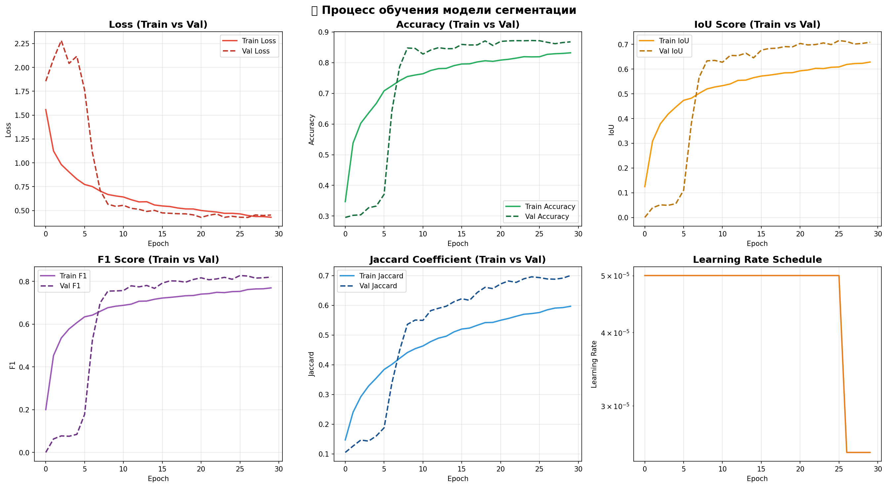
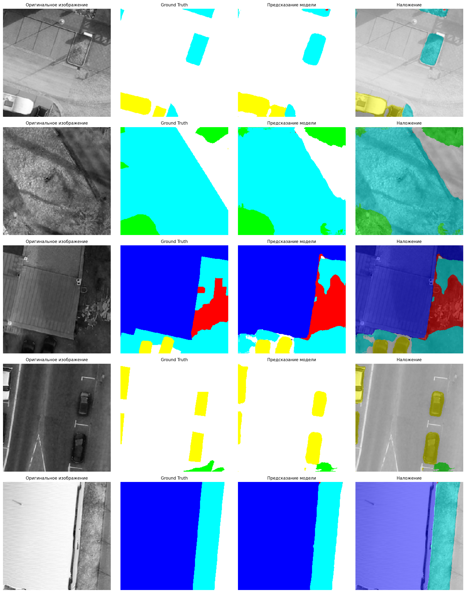
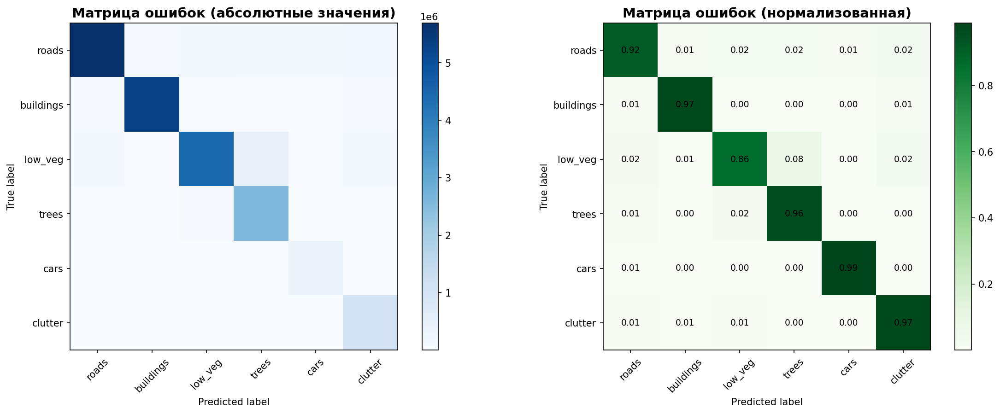

# 🛰️ Веб-приложение для сегментации зданий на аэрофотоснимках

Веб-приложение для автоматической семантической сегментации зданий и объектов городской инфраструктуры на аэрофотоснимках с использованием глубокого обучения (U-Net + ResNet34).

## 📋 Описание

Система выполняет попиксельную классификацию аэрофотоснимков на 6 классов:
- 🛣️ **Дороги** (roads) — дорожное покрытие, парковки
- 🏢 **Здания** (buildings) — жилые и промышленные здания
- 🌿 **Низкая растительность** (low vegetation) — газоны, кустарники
- 🌳 **Деревья** (trees) — деревья, лесные насаждения
- 🚗 **Автомобили** (cars) — транспортные средства
- 🔴 **Прочее** (clutter) — прочие объекты

**Архитектура:** U-Net с предобученным энкодером ResNet34  
**Датасет:** Potsdam (2400 патчей 300×300 px)  
**Качество:** IoU 71.56%, F1-Score 82.73%, Accuracy 87.22%

## 📸 Визуализация результатов

### Процесс обучения модели


### Результаты сегментации


### Матрица ошибок


## 🚀 Технологический стек

**Backend:**
- FastAPI 0.95.0 — REST API
- TensorFlow 2.10.0 — инференс модели
- Segmentation Models — предобученные архитектуры
- OpenCV — обработка изображений
- Uvicorn — ASGI сервер

**Frontend:**
- Streamlit 1.21.0 — интерактивный веб-интерфейс
- Pillow — работа с изображениями
- Requests — HTTP-клиент

**ML:**
- Архитектура: U-Net + ResNet34 encoder
- Framework: TensorFlow/Keras
- Transfer Learning: ImageNet weights
- Регуляризация: Dropout 30%, L2 weight decay
- Loss: Weighted Categorical Crossentropy

## 📦 Требования

### Минимальные
- Python 3.12
- 8 ГБ RAM
- 10 ГБ свободного места на диске
- Windows 10/11, Linux (Ubuntu 20.04+), macOS 11+

### Рекомендуемые
- Python 3.12
- 16 ГБ RAM
- NVIDIA GPU с 6+ ГБ VRAM (опционально, для ускорения)
- CUDA 11.2+ и cuDNN 8.1+ (для GPU)

## ⚡ Быстрый старт

### 1. Клонирование репозитория

```bash
git clone <repository-url>
cd segmentation-buildings
```

### 2. Создание виртуального окружения

**Windows:**
```cmd
python -m venv venv
venv\Scripts\activate
```

**Linux/macOS:**
```bash
python3.10 -m venv venv
source venv/bin/activate
```

### 3. Установка зависимостей

```bash
pip install --upgrade pip
pip install -r requirements.txt
```

### 4. Размещение модели

Убедитесь, что обученная модель находится в директории `models/`:

```
models/
└── best_segmentation_model.h5  (~93 МБ)
```

### 5. Запуск приложения

**Терминал 1 — Backend (FastAPI):**
```bash
uvicorn main:app --host 0.0.0.0 --port 8000 --reload
```

**Терминал 2 — Frontend (Streamlit):**
```bash
streamlit run app.py --server.port 8501
```

### 6. Открытие в браузере

- **Frontend:** http://localhost:8501
- **API Docs:** http://localhost:8000/docs
- **ReDoc:** http://localhost:8000/redoc

## 📁 Структура проекта

```
segmentation-buildings/
├── app.py                      # Frontend (Streamlit)
├── main.py                     # Backend API (FastAPI)
├── config.py                   # Конфигурация
├── requirements.txt            # Зависимости Python
├── models/                     # Обученные модели
│   ├── best_segmentation_model.h5
│   ├── training_history.csv
│   ├── training_plots.png
│   ├── validation_results.png
│   └── confusion_matrix.png
├── utils/                      # Утилиты
│   ├── image_processing.py     # Обработка изображений
│   ├── model_loader.py         # Загрузка модели и генераторы
│   ├── prediction.py           # Функции потерь и метрики
│   └── window.py               # Обработка больших изображений
├── data/                       # Данные (опционально)
│   └── patches/
│       ├── Images/
│       └── Labels/
└── notebooks/                  # Jupyter notebooks
    └── segmentation_buildings.ipynb
```

## 🔌 API Документация

### Проверка работоспособности

```bash
GET /
```

**Ответ:**
```json
{
  "сообщение": "API модели сегментации работает"
}
```

### Сегментация изображения

```bash
POST /predict/
```

**Параметры:**
- `file` (required) — изображение (JPEG, PNG, TIFF)

**Ограничения:**
- Максимальный размер: 4096×4096 пикселей

**Пример запроса (cURL):**
```bash
curl -X POST "http://localhost:8000/predict/" \
  -H "accept: image/png" \
  -H "Content-Type: multipart/form-data" \
  -F "file=@aerial_image.jpg" \
  --output result_segmentation.png
```

**Пример запроса (Python):**
```python
import requests
from PIL import Image
import io

with open('aerial_image.jpg', 'rb') as f:
    files = {'file': ('aerial_image.jpg', f, 'image/jpeg')}
    response = requests.post('http://localhost:8000/predict/', files=files)

if response.status_code == 200:
    result = Image.open(io.BytesIO(response.content))
    result.save('result_segmentation.png')
```

**Ответ:**
- Content-Type: `image/png`
- Размер: 256×256 пикселей
- Формат: PNG с цветовой маской

**Цветовая схема:**
- Белый `#FFFFFF` — дороги
- Синий `#0000FF` — здания
- Голубой `#00FFFF` — низкая растительность
- Зелёный `#00FF00` — деревья
- Жёлтый `#FFFF00` — автомобили
- Красный `#FF0000` — прочее

## 📊 Метрики модели

**Архитектура:** U-Net с ResNet34 энкодером (ImageNet weights)

**Параметры:**
- Всего параметров: 24.4 млн
- Размер модели: 93 МБ
- Входное разрешение: 256×256×3
- Выходные классы: 6

**Качество на валидационной выборке:**
- **IoU Score:** 71.56%
- **F1-Score:** 82.73%
- **Accuracy:** 87.22%
- **Jaccard Coefficient:** 70.05%

**Качество по классам (Accuracy):**
- Roads: 92%
- Buildings: 97% ⭐
- Low vegetation: 86%
- Trees: 96%
- Cars: 99% ⭐
- Clutter: 97%

**Производительность:**
- Время обработки: ~250-450 мс (GPU Tesla T4)
- Пропускная способность: ~180 запросов/минуту (4 workers)


## 🛠️ Разработка

### Структура кода

**Backend (main.py):**
- Загрузка модели при старте
- Валидация входных данных
- Предобработка изображений
- Инференс модели
- Постобработка и возврат результата

**Frontend (app.py):**
- Загрузка файлов (drag-and-drop)
- Отправка запросов к API
- Визуализация результатов
- Экспорт результатов (download)

**Утилиты (utils/):**
- `image_processing.py` — загрузка, конвертация, цветовое кодирование
- `model_loader.py` — генераторы данных, препроцессинг
- `prediction.py` — функции потерь, метрики, веса классов
- `window.py` — обработка больших изображений (sliding window)

### Запуск с автоперезагрузкой

```bash
# Backend
uvicorn main:app --reload

# Frontend
streamlit run app.py
```

### Запуск в продакшене

```bash
# Backend с несколькими workers
uvicorn main:app --host 0.0.0.0 --port 8000 --workers 4

# Frontend в headless режиме
streamlit run app.py --server.headless true
```

## 📝 Обучение модели

Обучение модели выполнено в Google Colab (notebook: `notebooks/segmentation_buildings.ipynb`)

**Ключевые особенности:**
- Dataset: Potsdam (2400 патчей, train/val 80/20)
- Augmentation: horizontal flip, vertical flip
- Batch size: 16
- Epochs: 30 (с Early Stopping)
- Optimizer: Adam (lr=5e-5, weight decay=1e-5)
- Loss: Weighted Categorical Crossentropy (для борьбы с дисбалансом классов)
- Callbacks: ModelCheckpoint, EarlyStopping, ReduceLROnPlateau

**Веса классов (для борьбы с дисбалансом):**
- Roads: 0.582
- Buildings: 0.610
- Low vegetation: 0.699
- Trees: 1.321
- **Cars: 9.260** (редкий класс, вес увеличен в 15.9×)
- Clutter: 2.884

## 🧪 Тестирование

### Проверка API

```bash
# Health check
curl http://localhost:8000/

# Тестовая сегментация
curl -X POST "http://localhost:8000/predict/" \
  -F "file=@test_image.jpg" \
  --output test_result.png
```

### Проверка модели

```python
from keras.models import load_model
from utils.prediction import jacard_coef, weighted_loss

model = load_model(
    'models/best_segmentation_model.h5',
    custom_objects={
        'jacard_coef': jacard_coef,
        'loss': weighted_loss
    }
)

print(model.summary())
```

## 📄 Лицензия

Этот проект разработан в рамках итоговой аттестационной работы.

## 🔗 Полезные ссылки

- [FastAPI документация](https://fastapi.tiangolo.com/)
- [Streamlit документация](https://docs.streamlit.io/)
- [Segmentation Models](https://github.com/qubvel/segmentation_models)
- [Potsdam Dataset](https://www.isprs.org/education/benchmarks/UrbanSemLab/)

**Статус проекта:** ✅ Готов к использованию  
**Последнее обновление:** 2025

